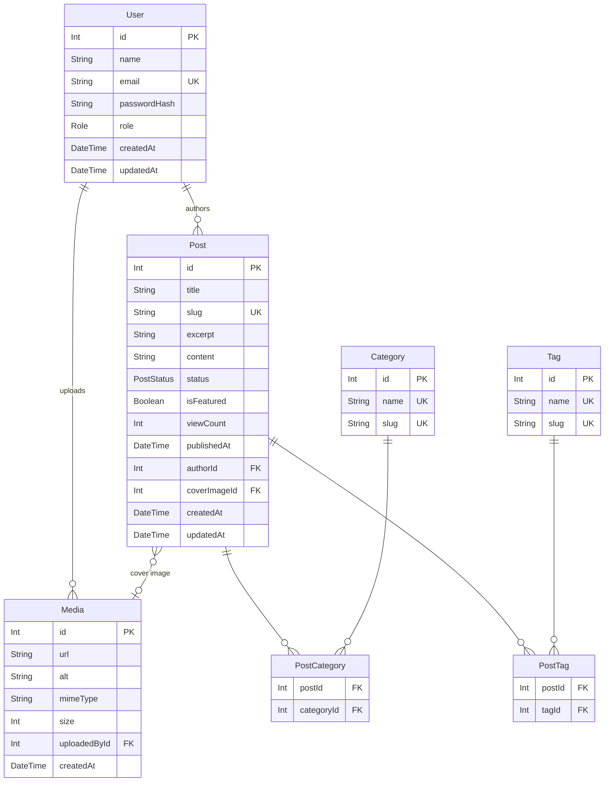

# Database Schema

The database is managed by **Prisma** with a **MariaDB / MySQL** provider.

Schema file: `prisma/schema.prisma`

---

## Entity Relationship Diagram



---

## Models

### User

Represents an authenticated user of the platform.

| Column | Type | Notes |
|---|---|---|
| `id` | `Int` | Auto-increment primary key |
| `name` | `String` | Display name |
| `email` | `String` | Unique, used for login |
| `passwordHash` | `String` | bcrypt-hashed password |
| `role` | `Role` | `ADMIN`, `EDITOR`, or `VIEWER` |
| `createdAt` | `DateTime` | Record creation timestamp |
| `updatedAt` | `DateTime` | Auto-updated on change |

### Post

Represents a blog article.

| Column | Type | Notes |
|---|---|---|
| `id` | `Int` | Auto-increment primary key |
| `title` | `String` | Article title |
| `slug` | `String` | Unique URL identifier |
| `excerpt` | `String?` | Optional short summary |
| `content` | `String` | Full body (Markdown or HTML) |
| `status` | `PostStatus` | `DRAFT` or `PUBLISHED` |
| `isFeatured` | `Boolean` | Highlights the post on the home page |
| `viewCount` | `Int` | Incremented on each page view |
| `publishedAt` | `DateTime?` | Nullable publish date |
| `authorId` | `Int` | FK → `User.id` |
| `coverImageId` | `Int?` | FK → `Media.id` |

### Media

Stores uploaded images and files.

| Column | Type | Notes |
|---|---|---|
| `id` | `Int` | Auto-increment primary key |
| `url` | `String` | Public URL of the asset |
| `alt` | `String?` | Accessibility alt text |
| `mimeType` | `String` | e.g. `image/png` |
| `size` | `Int?` | File size in bytes |
| `uploadedById` | `Int` | FK → `User.id` |

### Category

Taxonomy for grouping posts.

| Column | Type | Notes |
|---|---|---|
| `id` | `Int` | Auto-increment primary key |
| `name` | `String` | Unique display name |
| `slug` | `String` | Unique URL identifier |

### Tag

Lightweight labels for posts.

| Column | Type | Notes |
|---|---|---|
| `id` | `Int` | Auto-increment primary key |
| `name` | `String` | Unique display name |
| `slug` | `String` | Unique URL identifier |

### PostCategory / PostTag

Explicit many-to-many join tables.

| Column | Type | Notes |
|---|---|---|
| `postId` | `Int` | FK → `Post.id` |
| `categoryId` / `tagId` | `Int` | FK → `Category.id` / `Tag.id` |
| — | Composite PK | `(postId, categoryId)` / `(postId, tagId)` |

---

## Enums

### `Role`

| Value | Description |
|---|---|
| `ADMIN` | Full access: manage users, posts, and settings |
| `EDITOR` | Can create and manage posts |
| `VIEWER` | Read-only access (default for new users) |

### `PostStatus`

| Value | Description |
|---|---|
| `DRAFT` | Not publicly visible |
| `PUBLISHED` | Live and visible on the blog |

---

## Migrations

Migration files live in `prisma/migrations/`. Each migration has a timestamped folder and a `migration.sql` file.

To create a new migration during development:

```bash
npx prisma migrate dev --name describe-your-change
```

To apply migrations in production:

```bash
npx prisma migrate deploy
```
