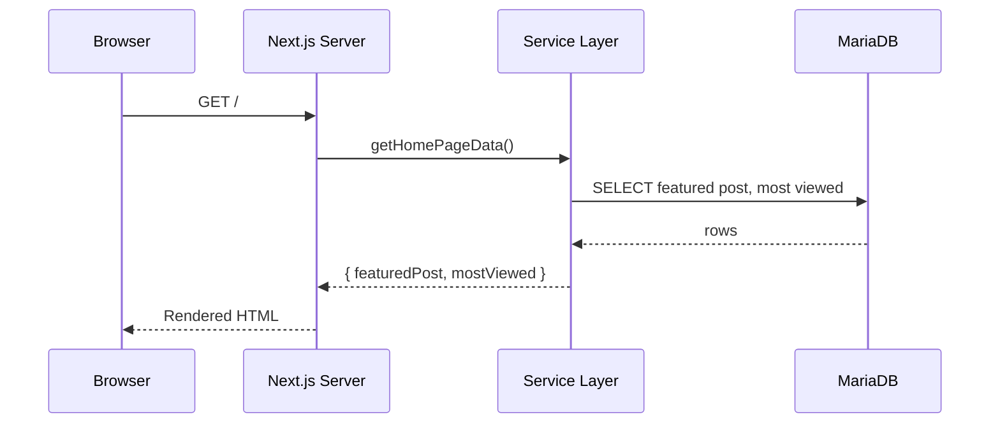

# Architecture Overview

My Blog App follows the **Next.js App Router** architecture with a clear separation between the public-facing blog, the admin panel, and the API layer.

## High-Level Architecture

```
Browser / Client
      │
      ▼
┌─────────────────────────────────────────────┐
│              Next.js App Router             │
│                                             │
│  ┌──────────────┐  ┌──────────────────────┐ │
│  │  Public Pages│  │    Admin Pages       │ │
│  │  / (Home)    │  │  /admin/dashboard    │ │
│  │  /posts      │  │  /admin/users        │ │
│  │  /posts/[slug│  │                      │ │
│  │  /login      │  │  (role-protected)    │ │
│  └──────────────┘  └──────────────────────┘ │
│                                             │
│  ┌──────────────────────────────────────┐   │
│  │           API Routes                 │   │
│  │  GET  /api/posts                     │   │
│  │  GET  /api/auth/[...nextauth]        │   │
│  │  POST /api/auth/[...nextauth]        │   │
│  └──────────────────────────────────────┘   │
└─────────────────────────────────────────────┘
      │
      ▼
┌─────────────────────────────────────────────┐
│              Service Layer                  │
│  src/lib/services/home.ts                   │
│  src/lib/services/posts.ts                  │
└─────────────────────────────────────────────┘
      │
      ▼
┌─────────────────────────────────────────────┐
│                 Prisma ORM                  │
│         src/lib/db.ts (singleton)           │
└─────────────────────────────────────────────┘
      │
      ▼
┌─────────────────────────────────────────────┐
│            MariaDB / MySQL                  │
└─────────────────────────────────────────────┘
```

## Request Flow

### Public Blog Request

1. User visits `/` or `/posts/[slug]`
2. Next.js Server Component calls a **service function** (e.g., `getHomePageData`)
3. The service queries the database via the **Prisma client singleton** (`src/lib/db.ts`)
4. Data is returned directly to the Server Component — no client-side fetching required

### API Request

1. Client calls `GET /api/posts?page=1&q=react`
2. The route handler at `src/app/api/posts/route.ts` parses query parameters
3. Calls `getPaginatedPosts` from the service layer
4. Returns a JSON response

### Authentication Flow

1. User submits email/password on `/login`
2. NextAuth's `CredentialsProvider` calls the `authorize` callback in `src/lib/auth.ts`
3. The callback fetches the user from the database and verifies the password with `bcryptjs`
4. On success, a JWT is issued containing the user's **role**
5. The role is surfaced on the `session` object via the `jwt` and `session` callbacks
6. Protected pages/routes check `session.user.role` before rendering

## Key Directories

| Path | Purpose |
|---|---|
| `src/app/` | All Next.js pages and API routes |
| `src/app/admin/` | Role-protected admin section |
| `src/app/api/` | REST API endpoints |
| `src/components/` | Reusable React components |
| `src/lib/` | Auth config, DB client, service functions |
| `prisma/` | Schema, migrations, and seed script |
| `public/` | Static assets |
| `docs/` | Project documentation (MkDocs) |

## Data Flow Diagram


